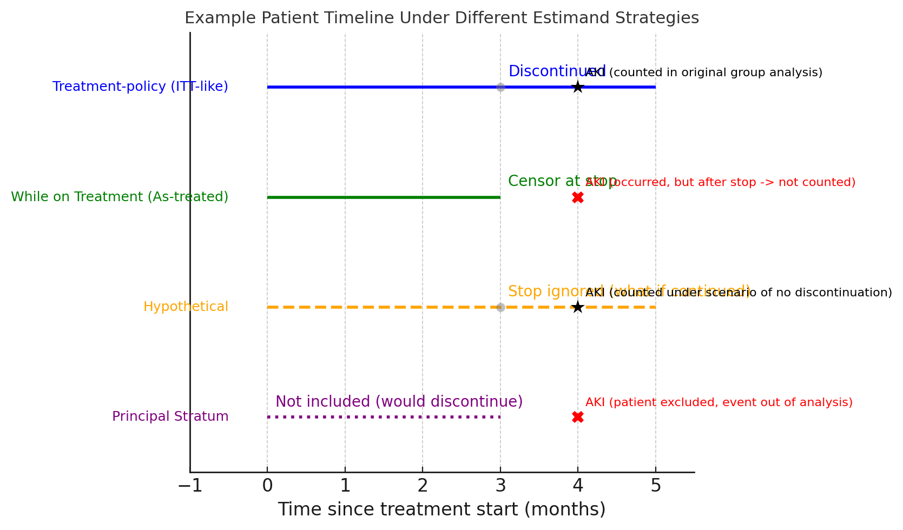

# Introduction

In this chapter, we will formulate the scientific question of interest as a causal question,  introduce estimands, choose an estimand for the analysis of the SOF vs non-SOF AKI data, and then discuss the implications of this decision and alternative estimands

## Formulation of the scientific question

In the causal inference roadmap, clearly defining the scientific question and target estimands is critical for valid analysis and interpretability. The first step in the causal roadmap involves translating a clinical or regulatory question into a clearly defined causal question. A well-formulated causal question clearly identifies the target population, interventions (or exposures), and outcomes of interest, helping define the target estimand. 


**Causal question** 

>Among U.S. adults (≥ 18 y) with chronic hepatitis C who newly initiate direct-acting antiviral therapy, what would the 90-day cumulative risk of first acute kidney injury be if every patient remained on their initial regimen for the full 90 days, comparing sofosbuvir-containing regimens with non-sofosbuvir regimens?

The question is articulated in Roadmap language: population, intervention, comparator, endpoint, time horizon. This aslo aligns with the **ICH E9(R1)** estimand framework, which emphasizes the importance of clearly defining the treatment condition of interest, population, endpoint, intercurrent events, and the population-level summary measure.


## Estimand Introduction – ICH E9(R1) Estimand Framework in RWE Analysis

What is an estimand? An estimand is a precise description of the treatment effect or quantity we aim to estimate, aligning the study objective with how data are collected and analyzed. This is distinct from the statistical estimator or estimate:

* **Estimand**: The target causal quantity we want (e.g. risk difference in 1-year incidence between treated vs. untreated).
* **Estimator**: The statistical method or formula we use to compute an estimate of the estimand from data (e.g. a regression model, TMLE algorithm, etc.).
* **Estimate**: The result we get from the estimator applied to our data (e.g. an estimated 1-year risk difference of -3%, meaning 3% fewer injuries with treatment).

By first nailing down the estimand, we ensure the estimator and resulting estimate are meaningful for the policy or clinical question.

The **ICH E9(R1) Addendum (2019)** introduced the estimand framework to ensure clarity and consistency from study design through analysis and interpretation. The document was drafted and agreed by the ICH E9(R1) Expert Working Group (EWG)— team of statisticians drawn from the regulatory authorities of every ICH Regulatory Member. The International Council for Harmonisation of Technical Requirements for Pharmaceuticals for Human Use (ICH) is a non-governmental consortium whose purpose is to create harmonised scientific and technical guidelines. In essence, an estimand defines “the target of estimation to address the scientific question of interest” for a study. By adopting the estimand mindset, RWE analyses can be more regulatory-aligned, as they explicitly state the causal question and handling of complexities in a way that regulators increasingly expect.
 
Key attributes of an estimand: 

  1. **Population** – the patients of interest  
  2. **Treatment** – the therapy or exposure condition and comparator  
  3. **Endpoint** – the outcome variable  
  4. **Intercurrent Events** – post-treatment events that can affect interpretation or existence of the outcome  
  5. **Summary measure** – how the treatment contrast is quantified (e.g., risk difference, hazard ratio)

For time-to-event outcomes (like time to acute kidney injury), this framework is especially important because multiple intercurrent events can occur during follow-up (patients might discontinue treatment, switch therapies, die, etc.), complicating how we interpret the outcome. ICH E9(R1) emphasizes that an estimand must address how each intercurrent event is handled as part of the clinical question; we cannot fully define “what effect we’re estimating” without specifying what we do if something like treatment discontinuation, addition of a rescue medication, or death happens during the study. This clarity is especially crucial in RWE studies, where such events are common and not under investigator control. 

By pre-specifying the estimand, we ensure the study design and analysis align with the real objective, avoiding common pitfalls. Historically, analyses sometimes defaulted to “intent-to-treat” principles or ad-hoc censoring without explicitly stating the question being answered. The estimand framework forces us to be explicit: Are we estimating the effect of initiating treatment no matter what happens after, or the effect while actually on the treatment, or under some hypothetical scenario, etc.? This upfront clarity improves communication with regulators and stakeholders, since everyone knows which treatment effect we mean. In fact as you will see in this example analysis, the estimand drives all subsequent study steps – design, conduct, analysis, and interpretation – ensuring they target the same goal.


# Causal Estimand

## Target population and eligibility

  * Adults ≥ 18 y with ≥ 12 months continuous enrollment and at least one HCV diagnosis.

  * No prior exposure to any DAA or documented AKI in the 12-month baseline.

  * Eligible for either regimen at the index dispense (pragmatic equipoise).

The simulated dataset (generate_hcv_data() in DGP.R) mirrors age, CKD, cirrhosis and HIV prevalence observed in the HealthVerity HCV cohort.


## Interventions (treatment strategies)

| Treatment regime | Description (target intervention) |
|------------------|------------------------------------|
| **A = 1** | Initiate any **sofosbuvir-containing** DAA regimen on Day 0 and **continue the same regimen without switching or discontinuation for 90 days**. |
| **A = 0** | Initiate a **non-sofosbuvir** DAA regimen on Day 0 and **continue the same regimen without switching or discontinuation for 90 days**. |

>Note: In the real-world claims data, patients may switch or discontinue therapy. Such deviations are handled analytically—patients are censored at first switch/discontinuation and inverse-probability-of-censoring weights (IPCW) are applied—to recover the above hypothetical sustained-exposure estimand.


  
## Intercurrent-event handling

| Intercurrent event | Primary ITT (treatment-policy) | While-on-Tx HR | Hypothetical no-switch | Principal stratum |
|--------------------|--------------------------------|----------------|------------------------|-------------------|
| **Regimen switch** | Ignore; follow patient regardless of changes | Censor 1 day after first switch | Intervention prevents switching via modeled hazard | Individuals who *would not* switch by week 8 belong to the stratum |
| **Death**          | Treated as independent censoring† | Same (censor) | Same | Same |
| **Disenrollment**  | Independent censoring (IPCW) | Same | Same | Same |

† Death is uncommon in the first 90 days of DAA therapy; a competing-risk
sensitivity analysis will be reported in Step 4. 

## Outcome & follow-up

  *  Outcome First AKI within 90 d (simulation event-time generator).

  *  Time 0: Start at dispense (t = 0); stop at 90 d, AKI, death, disenrollment, or regimen switch—according to chosen estimand.

## Causal Estimand


### Primary Estimand: Intention To Treat (Treatment-policy risk difference)

We propose using a while-on-treatment estimand (as-treated approach) as the primary estimand for the SOF vs non-SOF AKI analysis, which is the same approach as in the completed analysis, but we lay it out explicitly here.

**Definition:**  
  \[
    \psi_{\text{RD}} \;=\;
    \Pr\!\bigl\{Y^{(1)}\le 90\bigr\}
    \;-\;
    \Pr\!\bigl\{Y^{(0)}\le 90\bigr\}.
  \]

This means our estimand will target the causal effect of continuous treatment with a SOF-containing regimen versus a non-SOF regimen on the incidence of AKI, while patients remain on their initial treatment.

 In practical terms, the population is all patients initiating treatment for which either SOF or an alternative could be used; the treatment condition is “initiate and continue SOF-based therapy” vs “initiate and continue non-SOF therapy”; the outcome is time to AKI; intercurrent events: treatment discontinuation or switching will be handled with a treatment-period (while-on-treatment) strategy (we’ll censor follow-up at the time of regimen discontinuation/switch in each group), and perhaps define death as a competing risk or censoring event (since death can preclude observing AKI – one could treat death as censoring if unrelated to treatment or make a composite if considering “AKI or death” as a broader safety outcome, but for simplicity, let’s say we censor at death as well). The summary measure could be a hazard ratio or risk difference in AKI at a certain time point during therapy (e.g., by 12 weeks) -later we will advocate for the use of risk differences or ratios over hazard ratios for a more causal interpretation. This estimand aligns with asking: “Comparing SOF to no-SOF, what is the difference in probability of AKI during the treatment period?” 
 
The table below summarizes the proposed estimand:


| Attribute | Recommended specification for the **primary treatment-policy estimand** |
|---|---|
| **Population** | Adults (≥ 18 y) with chronic HCV who are eligible—at first contemporary treatment initiation—to receive **either** a SOF-containing or a non-SOF DAA regimen. |
| **Treatment strategies** | *Initiate* a SOF-containing regimen **vs** *initiate* a non-SOF regimen on day 0; **follow patients regardless of any subsequent discontinuation, augmentation, or switch** (treatment-policy strategy). |
| **Intercurrent-event strategies** | • **Regimen switch / discontinuation** → *ignored* (patient remains in original arm).<br>• **Death** → treated as independent censoring at date of death.<br>• **Lost to follow-up / disenrollment** → treated as censoring; handled with inverse-probability-of-censoring weights. |
| **Endpoint** | Cumulative incidence of the **first AKI** (KDIGO-compatible ICD-10 algorithm) within 90 days of treatment initiation; algorithm PPV documented in appendix. |
| **Summary measure** | **Primary:** 90-day absolute risk difference (SOF – non-SOF).<br>**Key secondary:** 90-day risk ratio and ΔRMST<sub>0–90</sub>. |
| **Sensitivity / supplementary estimands** | (i) While-on-treatment cause-specific HR (censor at switch).<br>(ii) Hypothetical “no-switch” ΔRisk via switch-hazard TMLE.<br>(iii) Principal-stratum ΔRisk among patients who would adhere ≥ 8 weeks. |
| **Rationale** | Treatment-policy estimand aligns with ICH E9(R1) for public-health decision-making: it answers *“What is the excess 90-day AKI risk attributable to prescribing SOF?”* Assumptions needed (baseline exchangeability, positivity, independent censoring) are diagnosable; estimator (TMLE) is double-robust and ML-enabled, facilitating regulatory acceptance. |


**Interpretation**  
  Absolute change in 90-day AKI risk attributable to prescribing a SOF-containing regimen, regardless of subsequent switching or discontinuation.

**Regulatory relevance**  
  Aligns with ICH E9(R1) “treatment-policy” strategy; informs population-level risk–benefit and product labeling decisions.
  
# Alternative Estimands

The completed AKI study used an **as-treated, censor-at-switch** estimand (★), and that is what we will focus on in this roadmap application, though in the sensitivity analysis section we estimate alternative estimands.\

Alternative estimands answer related questions or relax assumptions.


| Label | Strategy for switch / death | 90-day target | Question addressed | Identification caveats |
|---------------|---------------|---------------|---------------|---------------|
| **★ As-treated (censor at switch)** | Censor follow-up 30 d after switch; admin censoring for death/loss | RD / RR if everyone **remains on their original regimen** | Effect of staying on initial therapy | Requires ignorability of censoring given *W, A0* (+ time-varying covariates if used) |
| ITT (ignore switch) | Keep follow-up regardless of switch | RD / RR for **initiation** of SOF vs non-SOF | Policy effect of starting SOF | No informative censoring; effect diluted by cross-over |
| Per-protocol (model switch) | Treat switch as time-varying exposure; g-formula / MSM | Risk if everyone **remained** on assigned therapy | Pure biologic effect | Requires measurement & modelling of time-varying confounders and switching process |
| Hypothetical “no-switch” | Censor at switch **and** weight by inverse probability of switching | Risk had switching been prevented | Safety absent regimen changes | Correct model for switching hazard necessary |
| Composite (AKI *or* switch) | Count switch as event | RD / RR for **AKI or regimen change** | Captures clinical concern that switch may signal renal toxicity | Blurs pathways; easier for decision-making |
| Controlled direct effect | Treat death as competing risk (censor) | AKI risk if death eliminated | Kidney toxicity independent of mortality | Counterfactual elimination of death; strong & possibly implausible |

## Choosing among estimands

-   **Regulatory safety signal** – ★ As-treated is customary: isolates renal risk during exposure; beware informative switching.\
-   **Clinical decision (“start vs do not start”)** – ITT may be preferable.\
-   **Mechanistic/toxicology** – hypothetical or per-protocol estimands focus on inherent nephro-toxicity.

Subsequent Roadmap steps (identification, estimation, sensitivity) must align with the chosen estimand.


### Alternative Estimands

| **Label** | **Summary measure / 90-d target** | **Handling of switching** | **Handling of death / other competing risk** | **Causal question addressed** | **Identification assumptions / caveats** | **Regulatory / scientific role** |
|-----------|-----------------------------------|---------------------------|---------------------------------------------|--------------------------------|-------------------------------------------|----------------------------------|
| **★ As-treated (censor at switch)** | RD or RR for AKI ≤ 90 d among continuous users | Censor 30 d after first switch | Censor at death / loss / DB close | Effect of *staying* on the initial regimen through Day 90 | Censoring independent of outcome given baseline *W*, treatment *A* (plus time-varying covariates if used) | Counselling patients during therapy; quality-of-care benchmarking |
| **ITT (treatment-policy)** | ΔRisk\_0-90, RR | Ignore switch (follow regardless) | Censor at death / loss | Effect of *initiating* SOF vs non-SOF, irrespective of later changes | No informative censoring; treatment cross-over dilutes contrast | Public-health impact; drug-label language (chosen primary) |
| **While-on-Tx HR** | Cox HR (as-treated clock-reset) | Censor 1 d after first switch | Censor at death / loss | Instantaneous effect while continuously on the original regimen | Non-informative censoring; hazards proportional | Clinician decision-support during treatment |
| **ΔRMST** | RMST difference 0-90 d | Same as ITT (ignore switch) | Censor at death / loss | Mean delay/advance in AKI onset over 90 d | Same as ITT plus correct RMST model if cov-adj | Patient-centred interpretation when PH assumption fails |
| **Per-protocol (model switch)** | RD / RR (g-formula / MSM) 0-90 d | Switch treated as time-varying exposure and explicitly modelled | Censor at death / loss | Risk if everyone *remained* on assigned therapy | Correct specification of time-varying confounders & switching model | Mechanistic or biologic efficacy estimate |
| **Hypothetical “no-switch” (IPSW)** | ΔRisk\_0-90, RR | Censor at switch **and** weight by IPSW | Censor at death / loss | Risk had all switching been *prevented* | Correct model for switching hazard; positivity | Mechanistic safety assessment; sensitivity analysis |
| **Composite (AKI *or* switch)** | RD / RR for first AKI **or** regimen change ≤ 90 d | Count switch as an event | Death censored | Effect on “AKI-related adverse outcome” combining toxicity and clinical response | Composite mixes pathways; assumes same utility weight | Pragmatic decision-making when switch signals renal toxicity |
| **Controlled Direct Effect** | RD / RR 0-90 d | Censor at switch | Treat death as competing risk to be **eliminated** counter-factually | Kidney toxicity if death could not occur | Requires counter-factual elimination of death; strong, often implausible assumptions | Exploratory mechanistic inquiry; rarely primary |
| **Principal Stratum (always-adherers ≥ 8 wk)** | RD / RR 0-90 d within latent stratum | Restrict to patients who *would* stay ≥ 8 wk on original regimen | Censor at death / loss | Biological efficacy among guaranteed adherers | Stratification on unobservable behaviour; strong monotonicity / exclusion assumptions | Hypothesis-generating; subgroup exploration |


| Label | Strategy for switch / death | 90-day target | Question addressed | Identification caveats |
|---------------|---------------|---------------|---------------|---------------|
| **★ As-treated (censor at switch)** | Censor follow-up 30 d after switch; admin censoring for death/loss | RD / RR if everyone **remains on their original regimen** | Effect of staying on initial therapy | Requires ignorability of censoring given *W, A0* (+ time-varying covariates if used) |
| ITT (ignore switch) | Keep follow-up regardless of switch | RD / RR for **initiation** of SOF vs non-SOF | Policy effect of starting SOF | No informative censoring; effect diluted by cross-over |
| Per-protocol (model switch) | Treat switch as time-varying exposure; g-formula / MSM | Risk if everyone **remained** on assigned therapy | Pure biologic effect | Requires measurement & modelling of time-varying confounders and switching process |
| Hypothetical “no-switch” | Censor at switch **and** weight by inverse probability of switching | Risk had switching been prevented | Safety absent regimen changes | Correct model for switching hazard necessary |
| Composite (AKI *or* switch) | Count switch as event | RD / RR for **AKI or regimen change** | Captures clinical concern that switch may signal renal toxicity | Blurs pathways; easier for decision-making |
| Controlled direct effect | Treat death as competing risk (censor) | AKI risk if death eliminated | Kidney toxicity independent of mortality | Counterfactual elimination of death; strong & possibly implausible |

## Choosing among estimands

-   **Regulatory safety signal** – ★ As-treated is customary: isolates renal risk during exposure; beware informative switching.\
-   **Clinical decision (“start vs do not start”)** – ITT may be preferable.\
-   **Mechanistic/toxicology** – hypothetical or per-protocol estimands focus on inherent nephro-toxicity.

Subsequent Roadmap steps (identification, estimation, sensitivity) must align with the chosen estimand.


### Alternative Estimands

| Label | Summary measure\* | How intercurrent events are treated | Causal interpretation | Regulatory / scientific role |
|-------|-------------------|-------------------------------------|-----------------------|------------------------------|
| **ITT (Chosen Estimand)** | ΔRisk<sub>0–90</sub>, Risk Ratio | Post-index switching ignored; death = censor | Effect of *initiating* SOF vs non-SOF on any AKI ≤ 90 d | Public-health impact; labeling decisions |
| **While-on-Tx HR** | Cox HR<sub>as-treated</sub> | Censor 1 d after first regimen switch; death = censor | Effect while continuously on initial regimen | Clinician counselling during therapy |
| **ΔRMST** | RMST difference 0–90 d | Same as ITT (treatment-policy) | Mean delay/advance in AKI onset | Non-PH summary; patient-level meaning |
| **Hypothetical no-switch** | ΔRisk<sub>0–90</sub> | Model counterfactual world with switching blocked | Intrinsic nephrotoxicity absent regimen changes | Mechanistic assessment; sensitivity |
| **Principal stratum** | ΔRisk in “always-adherers” ≥ 8 wk | Restrict to latent subgroup | Biological efficacy among would-adherers | Exploratory; requires strong assumptions |

\*All summary measures are marginal (population-average) quantities.


####  While-on-Treatment hazard ratio (alternative)
Question “What happens while the patient actually remains on the initial regimen?”

Implementation Censor at first switch; TMLE with IPC weights or PS-matched Cox for legacy comparison.

Caveat Informative switching yields bias; addressed in Step 3 via weight diagnostics and hypothetical variant.

#### Restricted mean survival-time difference (alternative)
Motivation Resilient to non-proportional hazards; interpretable in days of AKI-free survival gained or lost.

Calculation Area under targeted survival curves (0–90 d); analytic EIF obtained from timepoints() grid.

Communication Patients and clinicians understand “SOF shortens AKI-free time by X hours”.

#### Hypothetical no-switch estimand (alternative)
Scenario World in which treatment switching is prevented.

Identification Needs no unmeasured common causes of switching & outcome; we fit switch-hazard and g-compute.

Role Separates pharmacologic nephrotoxicity from behavioral discontinuation patterns.

#### Principal-stratum estimand (alternative)
Subgroup Individuals who would adhere ≥ 8 weeks under either assignment (latent).

Assumptions Monotonicity & strong ignorability; estimated with substitution estimator + sensitivity band.

Purpose Exploratory mechanistic insight; not primary for decision-making.


# Note on the Implicit Estimand in the Completed SOF vs Non-SOF AKI Analysis

**Current analysis approach:** In the original cohort analysis, patients were classified at baseline into “SOF” vs “non-SOF” groups, and then followed for the outcome (AKI) over a period of time. The critical question is: how did the analysis handle patients who discontinued their treatment early or switched to a different regimen? This determines the implicit estimand. The analysis used a “while on treatment” (as-treated) estimand – meaning it focused on AKI occurrences during the period patients stayed on their initial therapy. In practical terms, if a patient stopped the initially prescribed treatment or switched to a different therapy, the analysis would censor their follow-up at that point (no longer counting their later time or events) so that only time actually exposed to SOF or to the comparison regimen contributed to the risk calculations. This corresponds to an estimand where the treatment effect is defined up until discontinuation of the originally assigned treatment. Intercurrent events like stopping or switching therapy are handled by essentially excluding (censoring) data after those events, rather than following the patient regardless. The underlying scientific question for this estimand is: “What is the effect of continuous treatment with SOF vs non-SOF on the hazard of AKI, while patients adhere to the initial treatment?” 

**Assumptions and implications:** This implicit as-treated/while-on-treatment estimand assumes that once a patient ceases the initial treatment, any further risk of AKI is no longer attributable to that treatment (hence not counted). It treats treatment changes as censoring events, which conceptually asks: what would the incidence of AKI be if patients had remained on their originally assigned treatment (up until the time of AKI or treatment cessation)? An important assumption here is that censoring due to treatment discontinuation or switch is not introducing bias – i.e. that patients who stop treatment are not systematically different (in unmeasured ways) in their risk of AKI than those who continue. In reality, this can be a strong assumption: for example, if some patients discontinued SOF because their renal function was worsening (an early sign of AKI risk), censoring them at discontinuation might miss AKI events related to the drug, underestimating the true harm. An alternative approach is to explicitly model the probability of censoring due to switch and re-weight the analysis through an inverse probability of censoring weighed analysis.
Despite this risk, the as-treated approach aligns with how drug safety is often assessed (focusing on events during exposure). It answers a clinically relevant question: “What is the kidney safety profile of the drug during the time patients are actually taking it?” Alternatively, had the analysis ignored treatment changes and simply followed everyone from initial treatment assignment to outcome (no matter if they switched or stopped therapy), it would correspond to a treatment-policy estimand (an ITT-like approach). A treatment-policy estimand treats intercurrent events as irrelevant – each patient is analyzed in their original group regardless of subsequent adherence or changes.

 If the SOF vs non-SOF analysis was done this way, it would implicitly be answering a different question: “What is the effect of starting SOF vs not, on risk of AKI, irrespective of whether patients stay on that initial treatment or not?” This would include AKI events even after therapy changes. Such an approach might be more pragmatic (reflecting real-world usage patterns), but in a short-term safety context like AKI during HCV therapy, it could dilute the observable effect of the drug. (For instance, if many SOF patients switched off the drug early, an ITT-style analysis might show little difference in AKI rates because those who would have been harmed stopped taking it – essentially comparing groups that become similar in exposure over time.) Hernán and Scharfstein caution against blindly using an ITT estimand when it doesn’t match the clinical question – e.g. an analysis that effectively compares “treat until completion” in one group vs “start treatment but possibly stop if toxicity arises” in the other could be asking an irrelevant or misleading question (https://www.researchgate.net/publication/333705608_A_constructive_critique_of_the_draft_ICH_E9_Addendum#:~:text=ICE%29%20and%20treatment%20%28e). 
 
In our case, a treatment-policy estimand would be akin to comparing “initiating SOF (even if one has to stop due to AKI risk) vs not initiating SOF”. That’s arguably not the question clinicians or regulators care about if the goal is to understand the drug’s inherent safety – they would be more interested in “what happens under the treatment while it’s given.” In summary, the retrospective SOF vs non-SOF AKI analysis most likely (even if not stated outright) adopted an as-treated (while-on-treatment) estimand, censoring at treatment discontinuation or switch.

This approach interprets the AKI outcome as a treatment-emergent adverse event – focusing on the period of exposure to each treatment. It inherently assumes that once a patient leaves the original treatment, their subsequent risk is outside the scope of our comparison. This estimand is appropriate for capturing on-treatment causal effects, but we must be mindful of its limitations: if patients who discontinue are different, or if the drug causes some latent injury that only manifests after stopping, the as-treated estimand could bias or undercount the true effect. These considerations motivate examining alternative estimand strategies.

# 3. Alternative Estimand Strategies and Their Causal Questions

Different estimand strategies address intercurrent events in different ways, each corresponding to a slightly different causal question. The ICH E9(R1) Addendum outlines several strategies (treatment-policy, hypothetical, while-on-treatment, principal stratum, etc.) (https://pmc.ncbi.nlm.nih.gov/articles/PMC8112325/#:~:text=Estimand%20strategy%20Measurement%20of%20interest,32). 

Here are four key strategies applied to the context of post-market drug safety and our SOF vs non-SOF case study, and clarify what question each estimand is answering:

●	Treatment-Policy (Intention-to-Treat-like): Under a treatment-policy strategy, intercurrent events are ignored in the sense that patients are analyzed according to the initial treatment assignment regardless of what happens afterward.

●	This is analogous to the classical ITT principle in trials. The outcome of interest is measured no matter if the patient discontinued the drug, switched to another therapy, or took additional treatments. The causal question answered is: “What is the effect of starting treatment A versus treatment B on the outcome, considering the policy of initially assigning that treatment and following patients thereafter, no matter if they continue it or not?” For our case: a treatment-policy estimand would compare all patients who started SOF to all who started non-SOF, in terms of AKI risk, regardless of treatment changes. This could be relevant for a public health or intent-to-treat perspective, e.g. a regulator might ask: “If we introduce SOF broadly, what is the overall impact on AKI rates in the population, accounting for the fact that some patients may stop or switch treatments?” The advantage of this strategy is that it uses all data and isn’t biased by who adheres to treatment – it mimics a pragmatic scenario. However, the trade-off is interpretability for safety: if many patients discontinue SOF due to early renal problems, a treatment-policy estimand will still count their later AKI (or lack thereof) in the SOF group, potentially underestimating the drug’s true nephrotoxic potential. It effectively answers a more diluted question, combining both the drug’s effect and the impact of stopping it. For drug safety questions, regulators and clinicians often find a pure ITT approach less informative, because it doesn’t isolate the period of actual drug exposure (as Hernán and colleagues note, an estimand that compares “never treat” vs “treat even in the face of contraindications/toxicity” is not clinically relevant.

●	While-On-Treatment (As-Treated): The while-on-treatment strategy (also called “as-treated” or “per-protocol” in some contexts) focuses on outcomes up until the time an intercurrent event occurs. Essentially, we follow patients only while they remain on the originally assigned treatment; if they discontinue or switch, we stop counting their outcomes thereafter (often treating them as censored at that point). The causal question here is: *“What is the effect of treatment A vs B on the outcome during the time patients actually stay on their intended treatment?”* This is the strategy we deduced the current SOF analysis used. In a safety context, this estimand is often most aligned with identifying the drug’s direct effects. For SOF vs non-SOF, it asks: *“Comparing patients continuously treated with SOF to those continuously treated with an alternative, what is the difference in AKI risk while on therapy?”* Any AKI that occurs after a patient stops or changes treatment is not attributed to the original treatment under this strategy. The benefit is clear interpretability for causation – it captures the period when the drug is actually present in the body and can cause harm. It aligns with the idea of treatment-emergent adverse events, which is often how clinical trials report safety (events are attributed to the treatment if they happened on or shortly after it). The strategy is particularly relevant to post-market pharmacovigilance if we want to know the risk during exposure – for example, it would feed into labeling like “AKI occurred in X% of patients during treatment”. The drawback is potential bias if the act of discontinuation is related to the outcome risk. In observational studies, one must consider that censoring at discontinuation assumes “non-informative” censoring (all prognostic factors leading to stopping are accounted for). If, say, patients with rising creatinine (a precursor to AKI) are more likely to stop SOF, a naive while-on-treatment analysis could censor them right before an AKI would have been observed, thereby underestimating AKI incidence on SOF. Despite this, analytic techniques (like modeling or inverse probability weighting) can mitigate some of this bias, and the while-on-treatment estimand remains very relevant for causal inference about the drug’s effect. It addresses the question most pertinent to clinicians: “What is the risk to my patient’s kidneys if they continue this drug versus if they were on an alternative?”


●	Hypothetical Strategy: A hypothetical estimand poses a “what-if” question by assuming a certain intercurrent event did not occur, and then evaluating the outcome under that scenario. In other words, we imagine a hypothetical world in which, for example, all patients remained on their originally assigned treatment (no one discontinued or switched), and ask what the treatment effect on AKI would be in that world. This requires modeling or extrapolation because the data for patients after they discontinue are essentially missing in that hypothetical scenario. In our SOF example, a hypothetical estimand might be: “What would the incidence of AKI be comparing SOF vs non-SOF if no patient in either group ever discontinued or switched treatments (i.e., if everyone completed the full intended course of therapy)?” This is conceptually similar to the while-on-treatment approach, with the difference that it explicitly frames it as a counterfactual scenario and often involves imputing or modeling outcomes for those who did discontinue. The hypothetical strategy is useful if we want to remove the effect of certain real-world behaviors to isolate the treatment’s effect under optimal conditions or specific conditions. In post-market safety, one might use a hypothetical estimand if interested in, say, the safety profile had patients been able to tolerate the drug continuously. It is somewhat less common in pure safety analyses, but could be relevant for understanding intrinsic drug effects. The challenge with the hypothetical approach is implementation – because some outcomes are not observed (due to the event we assume away), one must rely on assumptions or statistical models (e.g., modeling the AKI risk as if treatment had continued for those who stopped). If those assumptions are wrong, it can introduce bias. Conceptually, though, it asks a clear causal question and is aligned with counterfactual reasoning. Regulatory guidance acknowledges hypothetical estimands as valid in certain cases (for example, in trials, “what would outcome be if patients did not take rescue medication” is a common hypothetical scenario. In RWE, we would use this strategy sparingly and carefully, usually to supplement an analysis – for instance, to estimate the full-course effect of SOF vs non-SOF if early discontinuation is frequent.


●	Principal Stratum Strategy: The principal stratum strategy focuses on a subset of patients defined by some post-treatment behavior or event (often a subset in which an intercurrent event does or does not occur). The estimand is then the treatment effect within that subgroup – the subgroup is defined in a way that is not affected by treatment assignment (hence “principal stratum” in causal inference terms). A classic example: “the effect of treatment among those patients who would adhere to treatment in both the treatment and control conditions.” In our context, one could think of a principal stratum like “patients who would complete a full course of therapy regardless of whether they were on SOF or non-SOF.” That stratum would exclude patients prone to discontinuation. The causal question becomes: “Among patients who (hypothetically) would stay on their assigned treatment no matter which treatment they got, what is the effect of SOF vs non-SOF on AKI?” This is appealing because it compares outcomes in a group of patients unaffected by adherence issues – essentially a per-protocol effect without the usual adherence bias, if it could be identified. Another principal stratum of interest could be “the effect in patients who would not experience acute liver failure (another competing event) under either treatment” – any intercurrent event can define a stratum. The issue is that principal strata are defined counterfactually and can’t be directly observed (we don’t know which patients would adhere under both scenarios, for example). Estimating effects in principal strata often requires strong assumptions or specialized methods (e.g. monotonicity assumptions, sensitivity analyses). It’s rarely used as the primary estimand in observational studies because of these challenges. However, it’s conceptually relevant: for instance, regulators might be interested in the “intrinsic efficacy or safety in patients who can tolerate the drug”. In our SOF example, a principal stratum estimand might help answer: “If we consider only those patients who are able to complete therapy, does SOF have a different impact on AKI than comparator?” One could attempt to approximate this by analyzing a subset of patients who actually completed treatment in both groups (acknowledging that introduces selection bias). Trade-offs: principal stratum estimands improve interpretability for a specific scenario (e.g., ideal adherers), but sacrifice generalizability (the effect may not apply to all patients) and are hard to estimate without bias. They are more often seen in clinical trial contexts or sensitivity analyses. For routine pharmacovigilance, one would typically not choose principal stratum as the primary approach, but it’s good to be aware of it as a conceptual tool – it reminds us that treatment effects can differ in sub-populations defined by post-treatment events (for example, “compliers” vs “non-compliers”).

 
```{r, echo=FALSE}


```
 
 
**Figure 1:** Illustration of how a hypothetical patient’s AKI event would be handled under different estimand strategies. In this scenario, the patient starts treatment at time 0, discontinues therapy at month 3 (gray circle), and then experiences an AKI at month 4 (star symbol). Under a treatment-policy estimand (blue line), we ignore the discontinuation and count the AKI as an outcome for the original treatment group (the patient is analyzed as if they were still on treatment). Under a while-on-treatment estimand (green line), we would censor the patient at the moment of discontinuation (vertical tick mark at month 3); any AKI occurring after stopping (the red “X” at month 4) is not counted for the original treatment. The hypothetical estimand (orange dashed line) imagines the patient had not discontinued – effectively, it considers the AKI at month 4 as if the patient were still on treatment (treating the gray stop marker as ignored). The principal stratum estimand focusing on completers (purple dotted line) would exclude this patient entirely, since they did discontinue; thus, their AKI outcome is outside the analysis for that stratum. This figure highlights how each strategy defines the “effect of treatment” slightly differently: treatment-policy uses all outcomes regardless of adherence, while-on-treatment uses only outcomes during actual treatment, hypothetical projects outcomes as if adherence were perfect, and principal stratum restricts to those without the intercurrent event. Each of these strategies can be appropriate depending on the objective of the study. In a post-market safety setting, we typically ask: “Does the drug cause the adverse outcome when used in practice?” If we are aiming to isolate the drug’s causal effect, a while-on-treatment or certain hypothetical estimand is often most suitable. If instead we care about the public health impact of using the drug (where adherence issues are part of the picture), a treatment-policy estimand might be informative. It’s important to formulate the estimand that best matches the causal question we want answered, as we will do next for the SOF vs non-SOF analysis.


 


*Detailed Justification for chosen estimand in the appendix

# 6. Alternative Estimand Strategies and Trade-offs for SOF vs Non-SOF (Discussion)

Having recommended the while-on-treatment estimand, it’s important to acknowledge other reasonable estimand choices and discuss their pros and cons in this context:

●	Treatment-Policy as an alternative: A treatment-policy estimand (ITT-like) could be justified if our objective was more about the overall impact of initiating SOF on patient outcomes, rather than the direct causal effect of the drug. For example, a public health authority might be interested in “if 1,000 patients are started on SOF vs 1,000 on older regimens, how many AKI cases will ultimately occur in each group?” This includes the fact that some patients may stop the drug – which in practice could limit the harm (because those who experience issues stop early). A treatment-policy analysis would capture that dynamic. The advantage is it reflects “real-world use” including adherence patterns. It also avoids the need to model or adjust for post-baseline variables – you simply follow everyone. In a randomized trial, ITT is king for efficacy to avoid bias; for safety in observational data, however, the situation is trickier. The drawback of treatment-policy here is potential dilution of the drug’s effect. If SOF truly causes AKI, many patients might discontinue at first sign of kidney issues – those patients might avoid full-blown AKI (which is good for them, but the analysis would then count them as not having AKI while on SOF, even though SOF precipitated the problem that made them stop). Thus, the ITT estimand might conclude “no big difference in AKI rates,” whereas in truth SOF had nephrotoxic potential but it was mitigated by clinicians stopping the drug. From a regulator’s perspective, that ITT result is less useful because it doesn’t reveal the drug’s inherent risk. That said, a treatment-policy estimand could be an equally valid secondary analysis – it answers a complementary question: “what is the risk difference in a world where patients and doctors behave normally (stopping when needed)?” This might be relevant for risk-benefit assessment on a population level. For instance, if ITT shows only a tiny increase in AKI (because many at-risk patients stopped early), regulators might consider that in context of drug benefits. But they would still want to know the on-treatment risk to properly caution and manage patients. In summary, treatment-policy is not our choice for primary estimand due to interpretability concerns for safety, but it is not “wrong” – it’s just answering a different question. It has lower internal bias (no selection due to censoring) but mixes in the effects of patient management.

●	Hypothetical estimand trade-offs: The hypothetical strategy (imagine no one discontinued) in practice often ends up looking similar to the while-on-treatment analysis, except achieved via modeling rather than actual censoring. If our data shows, say, 90% of patients completed therapy, a while-on-treatment estimand already is very close to “everyone continued” scenario. If discontinuation rates are higher, one might consider a hypothetical estimand to estimate “if 100% continued.” The benefit of the hypothetical approach is that it directly addresses the question of full adherence without excluding those patients from the analysis (unlike censoring). Modern methods (like multiple imputation for treatment continuation) could be used to estimate what their outcomes might have been. The cost, however, is the strong modeling assumptions required. If we model kidney outcomes beyond discontinuation, we must correctly account for why they discontinued and how that relates to AKI risk. Mis-specification can lead to bias as well. In regulatory settings, hypothetical estimands have been used for efficacy (e.g. “if no rescue medication, what would the outcome have been” in glucose trials). For safety, it’s less common to explicitly do a hypothetical because the while-on-treatment analysis already addresses a similar question in a more straightforward way (by using observed data up to discontinuation). Nevertheless, one could consider a hypothetical estimand as a sensitivity analysis: for example, “assuming patients who stopped SOF had the same risk profile as if they stayed on it, how many AKIs would have occurred?” If that yields similar results to the as-treated analysis, it increases confidence; if it differs, it suggests the censoring might have missed something. In the SOF vs non-SOF study, a hypothetical estimand isn’t necessary given we can handle things via censoring, but it’s conceptually equivalent to ensuring our inference is about the treatment effect under continuous use.

●	Principal Stratum considerations: As noted, a principal stratum estimand like “effect among those who would adhere to treatment in both groups” is hard to identify but could be of scientific interest. It essentially removes the noise of non-adherence from both sides. The trade-off is that it pertains to a subset of patients (those who can tolerate and stick with therapy). If, for instance, younger patients with no comorbidities are the ones who would never stop either treatment, the principal stratum effect applies mostly to that kind of patient. It might be different from the effect in older patients who tend to discontinue more. Thus, principal stratum estimands sacrifice generalizability – you answer a very specific question about a hypothetical subgroup. They also require either simplifying assumptions or sophisticated causal inference techniques (like instrumental variable approaches or sensitivity analyses) to estimate. In an observational SOF vs non-SOF study, one way to approximate this is to restrict the analysis to patients who actually completed therapy in both groups (observational analog of per-protocol analysis). That is essentially conditioning on adherence, which is biased (adherers may differ from non-adherers). So, one might use inverse probability weighting to create a pseudo-population that represents the principal stratum of completers. This is advanced and would likely be beyond what an RWE team needs for a routine analysis unless there’s a strong reason to focus on that question. Generally, we’d mention principal stratum only if, say, the sponsor or regulator asked: “What is the effect in patients who can actually complete the therapy course? Is it different?” If that’s a concern, one could do a secondary analysis on completers, acknowledging its limitations.

Bias, interpretability, generalizability summary: Each estimand involves trade-offs:

●	Bias: Treatment-policy avoids bias from informative censoring but can “dilute” the effect; as-treated isolates the effect but can introduce bias if not handled properly (need to account for why censoring happens). Hypothetical relies on model assumptions (risk of model bias). Principal stratum avoids some biases by narrowing focus but introduces others (selection bias, unless perfectly adjusted).

●	Interpretability: As-treated and hypothetical directly address causal effects of the drug (easy for clinicians to interpret “while on drug vs while off drug”). Treatment-policy is a mix of drug effect and adherence behavior – interpretability is a bit more complicated (“effect of starting treatment strategy”). Principal stratum is clear in meaning (“effect in this subgroup”) but that subgroup is not directly observable – a bit abstract.

●	Generalizability: Treatment-policy might generalize best to broad practice (since it includes everything that happens in practice). As-treated/hypothetical generalize to situations of good adherence or controlled treatment use – which is often what we want for understanding the drug, but if adherence patterns differ across populations, the effect could differ. Principal stratum by definition is not aiming to generalize to the whole population, just a part.

In the case of SOF vs non-SOF, we believe the bias introduced by as-treated is manageable (we can adjust for baseline differences and we will demonstrate techniques to handle differential censoring using targeted maximum likelihood estimation) and is worth the gain in causal interpretability. Treatment-policy would be more likely to understate a true causal harm if one exists (a form of bias in estimating the causal effect of continuous treatment, though it’s unbiased for the “policy” effect). Importantly, if the estimand is properly aligned to the question, then “bias” must be defined relative to that question. So an ITT analysis isn’t “biased” if the estimand of interest was truly the policy effect; it just might be answering a less relevant question for safety. Thus, a key part of estimand selection is picking the question such that the resulting estimate is meaningful and actionable. For completeness, we might pre-specify that we will also estimate a secondary treatment-policy estimand for AKI, to see the difference. If, for example, the as-treated analysis shows a significantly higher AKI risk on SOF, but the ITT analysis shows little difference, that tells a story: the drug causes problems, but patients and doctors are mitigating it by discontinuing (so ultimate outcomes converge). Both pieces of information can be valuable. We would explain that difference in regulatory discussions – it actually illustrates how clinical management can reduce harm. Conversely, if both ITT and as-treated show a similar elevated risk, it means even including the “real-world adherence” factor, SOF still carries the same risk, underscoring a robust safety signal.

7. General Advice on Estimand Selection in RWE Time-to-Event Safety Analyses

To conclude, here are some generalizable tips for selecting estimands in real-world evidence studies of post-market safety (time-to-event outcomes):

●	Start with a well-defined research question: Clearly articulate what decision or effect you are interested in. Is it the effect of initiating a therapy vs not (or vs another therapy) on an outcome, regardless of what happens later? Or the effect of actually being exposed to the therapy on that outcome? Or perhaps the effect in a particular patient subset? Writing this out in plain language helps identify the estimand. For example: “Do patients have a higher risk of AKI while on Drug A compared to Drug B?” points to a while-on-treatment estimand, whereas “If we prescribe Drug A instead of Drug B, will fewer patients develop AKI within 1 year?” points to a more treatment-policy estimand.

●	Emulate a “target trial” to define estimand attributes: As a framework, imagine you were designing the ideal randomized trial to answer your question. 

Define who you would include (population), what the treatment and comparison arms would be (treatment strategies), how you’d handle changes in treatment in the protocol, when follow-up would start and end, and what outcome you’d measure. This exercise naturally defines the estimand. In the trial protocol you’d specify if patients are allowed to switch or if they’d be taken off study drug upon certain events – those translate to estimand strategies. By doing this, you make sure your observational study’s estimand is concrete. For instance, target trial emulation for a safety study might decide that if a patient in the trial has a toxicity, they discontinue per protocol – aligning with a while-on-treatment estimand (because after discontinuation, their outcome isn’t counted towards primary endpoint). You then ensure your observational analysis mirrors that (censor at discontinuation in analysis). Hernán et al. note that making the target trial explicit is a good practice and a “reasonably well-defined trial” should be emulated as closely as possible – if you can’t even define a meaningful target trial, the RWE study question might be too vague.

Identify all relevant intercurrent events: In time-to-event analyses, common intercurrent events include treatment discontinuation, switching to a new treatment, addition of concomitant treatments, and death. Also consider events like hospitalization that might interrupt treatment, etc., if relevant. For each type of intercurrent event, consciously decide on a strategy before you see the data. Ask how each event impacts the interpretation of the outcome. For example, “If the patient switches to another drug, do I still attribute subsequent events to the original drug (treatment-policy), or do I stop follow-up at that point (while-on-treatment), or do I consider a hypothetical scenario where they hadn’t switched?” There isn’t one correct answer for all studies – it depends on the question. But you need to pre-specify it. This prevents bias and p-hacking, and it makes the study reproducible and transparent.

●	Align the estimand with the study’s purpose (stakeholder needs): Different stakeholders may care about different effects. Clinicians might want to know the per-protocol effect (what happens if my patient actually takes this drug as intended). Regulators might want the policy effect (what happens in aggregate if this drug is on the market and used with typical adherence). Patients might want to know their personal risk if they adhere to treatment. Usually for safety, the clinical and regulatory interest is in the actual causal effect of the drug, so an estimand that gets closer to that (like while-on-treatment) is favored. But if your study is meant to inform, say, formulary decisions or cost-effectiveness, a more pragmatic estimand might be used. The key is: think from the end-user’s perspective – what question do they need answered? Then choose the estimand that answers it. This prevents situations where you present an analysis that, while statistically correct, doesn’t address the real concern of decision-makers.


Beware of implicitly unrealistic estimands: As Hernán & Scharfstein warned, don’t inadvertently answer a question that nobody is asking or that is not actionable. For example, an estimand that effectively compares “patients who stay on Drug A no matter what” to “patients who can switch away from Drug B if issues arise” would be a mismatched comparison. Ensure symmetry in comparisons and clinical relevance. If certain intercurrent events are very likely (e.g., many will switch), a pure hypothetical of “nobody switches” might be too far from reality to be useful (unless you’re specifically interested in that scenario). Balance realism with the desire to isolate effects.

●	Plan for analysis methods that match the estimand: Once you choose an estimand, make sure your statistical approach follows suit. For a while-on-treatment estimand, you will likely be censoring data – so use methods to handle that (Kaplan-Meier, Cox models with appropriate censoring, maybe inverse probability of censoring weights if censoring is informative). For a treatment-policy estimand, ensure you’re not censoring at treatment changes (but you might need methods to handle treatment switching as a form of confounding if patients switched due to risk – e.g., rank-preserving structural models or treat switch as time-varying exposure in a sensitivity analysis). If using a hypothetical estimand, define the modeling approach to impute or project outcomes (like “we will use a joint model to extrapolate kidney function trajectory as if treatment continued”). Essentially, the estimand tells you what data to use or not use, and the analysis must implement that faithfully. 

Also, consider missing data separate from estimand – per ICH E9, missing data (loss to follow-up, etc.) is not an intercurrent event but a challenge to address analytically. So plan imputation or sensitivity for missing data after defining the estimand.

	Conduct sensitivity analyses for alternative estimands: It’s often informative to do your primary analysis under one estimand and a secondary under another to see how conclusions differ. Especially in RWE, where assumptions are strong, demonstrating consistency across estimand strategies can bolster confidence. For example, if you choose while-on-treatment as primary, you might also report an ITT-like analysis. If results converge (e.g., both show elevated risk), great – robust finding. If they diverge, that tells a story (as discussed, perhaps indicating the effect is manifested only while on drug). Similarly, one could try a principal stratum approximation (like per-protocol analysis in those who adhered, acknowledging biases) to see if the effect is larger or smaller in that subset. Consistency across these gives insight into how intercurrent events influence the observed effect. When presenting to regulators, acknowledging these alternate analyses shows you have thoroughly examined the question from multiple angles and understand the impact of your assumptions

●	Document and justify your choices: In any protocol or report, explicitly state the estimand (with its components) and why it was chosen. For instance, “We chose a treatment-period estimand because we are interested in the on-treatment causal effect of Drug X on Event Y, and this aligns with how the adverse event would be attributed to the drug clinically.” Also explain how each type of intercurrent event is handled and why that is appropriate. This level of detail will make it easier for others (e.g., a regulatory reviewer) to follow your logic and agree that the analysis is answering the right question. It also makes the study reproducible, as another researcher could apply the same estimand definition to a different dataset and expect to address the same question.

●	Involve clinical experts in estimand discussions: Estimand selection is inherently multidisciplinary.
Engage clinicians or pharmacovigilance experts who understand the disease, treatment, and real-world patient behavior. They can provide insight on which events are important and how best to define the question. For example, a clinician might say “If a patient’s creatinine starts rising, I’d stop the drug immediately” – which supports a while-on-treatment approach or a composite endpoint including “rise in creatinine leading to stop.” Such input ensures the estimand is grounded in real clinical pathways.

●	Keep the estimand simple and focused: Especially for an audience not deeply familiar with the estimand framework, it’s important to communicate the estimand in a clear, concise way. Avoid overly technical language when explaining it to stakeholders – you can use plain language alongside the formal definition. For instance, you might say: “Our estimand is essentially looking at the risk difference in AKI between the two treatments during the time patients are actually on those treatments.” Once that concept is understood, you can layer in the finer points of censoring rules, etc. The goal is everyone (analysts, clinicians, decision-makers) has a shared understanding of what is being estimated.
By following these principles, an RWE team can confidently select and implement an estimand that makes their analysis robust, transparent, and fit for purpose. In the case of our SOF vs non-SOF AKI analysis, this approach led us to focus on the treatment-period effect, providing a clear answer to the causal question of interest. Adopting the estimand framework in observational research ultimately improves the quality of evidence we generate, ensuring it answers the questions that matter in a rigorous way.


\## 1.3 Defining Causal Estimands An **estimand** is a precisely defined causal parameter representing what we aim to estimate. The International Council for Harmonisation (ICH) guideline E9(R1) highlights the importance of clearly defining estimands in clinical trials and real-world studies to ensure clarity about the causal effects being studied. Different ways of handling intercurrent events—such as treatment switching—lead to different estimands, each with distinct interpretations. Clearly specifying the estimand upfront is crucial for study validity. 

\### Common Estimand Choices We summarize several common estimands below, indicating clearly which was selected as the primary in the original AKI analysis (**marked ★**):

| Label |How are intercurrent events handled? |Target (90-day) |Scientific meaning |Key assumptions|
|-------|--------------------------------------|-----------------|--------------------|-----------------|
| **\^As-treated** |Censor follow-up after regimen switch (30-day wash-out), death, loss |Risk if patients adhered to initial regimen (RD/RR) |Direct toxicity of regimen while taken |Non-informative censoring (no unmeasured predictors of switching) |
| ITT (Treatment Policy) |Ignore switching events, follow regardless |Risk for initial treatment assignment (RD/RR) |Real-world policy decision: start SOF vs not |Switching dilutes effect; requires no assumption about censoring |
| Per-protocol |Model switching explicitly (time-varying exposure), adjust via weighting/g-formula |Risk if all remained on assigned treatment |"Biological" toxicity unaffected by treatment changes |Needs correctly specified time-dependent exposure/confounder models ||Hypothetical "no-switch" |Censor at switch and use inverse probability weighting |Risk if no one switched |Idealized scenario without regimen changes |Correct modeling of switching events |
| Composite endpoint |Include regimen switch as outcome event |Combined risk of AKI or treatment change |Practical endpoint capturing clinical action driven by renal issues |Blurs biological and clinical decision-making pathways |
| Controlled Direct Effect |Treat death as competing event |AKI risk if death eliminated |Toxicity independent of mortality |Counterfactual scenario (removing death) potentially unrealistic |### Why consider alternative estimands? - **Intention-to-treat (ITT)** aligns with clinical decision-making or policy perspectives ("Should we initiate SOF treatment in real-world conditions?"). - **Per-protocol or hypothetical** estimands address potential bias from informative switching, providing insight into inherent treatment effects under strict adherence scenarios. - **Composite endpoints** increase statistical power and align with regulatory frameworks interested in signals triggering clinical action. - **Controlled direct effects** are relevant if substantial mortality exists and understanding direct drug-toxicity independent of death is critical. 

## 1.4 Choosing the Primary Estimand T

he AKI safety study primarily adopted an **as-treated, censor-at-switch estimand (★)**. This choice reflects a regulatory and clinical preference for quantifying the direct, drug-induced renal toxicity experienced while actually receiving the assigned therapy. **Why choose the as-treated estimand?** - Aligns closely with standard regulatory practice for safety signals. - Clearly interpretable in terms of drug-exposure-related harm. - Assumptions required (non-informative censoring) considered acceptable in this short-term context. Alternative estimands are planned as secondary or sensitivity analyses to assess robustness and potential biases arising from informative censoring or switching. ## 1.5 Summarizing Step 1 This step highlights the importance of clearly defining the scientific question, causal model (DAG), and causal estimands early in the analysis roadmap. Each decision made here shapes the analytic approach, informs interpretation, and provides transparency regarding the assumptions and their potential impact on results.|


Target trial emulation: Explicit framing of observational studies as emulations of hypothetical randomized controlled trials (RCTs) helps clarify causal questions and ensures proper alignment of the estimand with clinical or regulatory relevance.

Restricted Mean Survival Time (RMST): Suggested as an additional estimand, especially beneficial under non-proportional hazards conditions due to interpretability as an average delay in event occurrence.


### Table 1 

Menu of candidate estimands | # | Label | Measure | Population & intercurrent-event strategy | Interpretation | Notes |
|---|-----------------------------|-----------------|------------------------------------------------------------|--------------------------------------------------|-------| 
| **1** | **Primary ITT** | ΔRisk, RR | All initiators; ignore switching (treatment-policy) | Effect of *offering* SOF regimen | Regulatory default | 
| 2 | ITT RMST diff | RMST\_0-90 | Same as 1 | Average delay in AKI | Non-PH robust | 
| 3 | Per-protocol | ΔRisk on-tx | Censor 30 d after switch | Effect of *continuous exposure* | Needs IPCW | 
| 4 | Cause-specific HR | Cox HR | Censor at switch/death | Instantaneous hazard ratio | HR caveats  | 
| 5 | Sub-distribution HR | Fine-Gray SHR | Treat death as competing risk | Effect on cumulative incidence | | 
| 6 | Principal stratum | RD in adherers | Restrict to “would adhere ≥ 8 wk” stratum | Biological efficacy | Strong assumptions | 
| 7 | CKD subgroup | RD \| CKD | eGFR < 60 at baseline | Effect in CKD population | Lower power | 
| 8 | Guideline g-formula | ΔRisk under rule| Dynamic rule: “start SOF if eGFR > 30” | Effect of guideline policy | Needs longitudinal TMLE | 


| Strategy | Core idea & target quantity | Scientific question answered | Typical analytical choices | 
|----------|----------------------------|------------------------------|----------------------------| 
| **Treatment-policy** (“intention-to-treat–like”) | The outcome is taken **as observed**, regardless of any post-randomization (intercurrent) events. The target parameter is the effect had *everyone been assigned* the experimental vs. control regimen, with no restrictions on what happens thereafter. | *“What is the effect of starting treatment X compared with Y in real-world clinical use, where dose changes, rescue meds and adherence issues occur?”* | Analyse all randomized patients from time 0 to the planned end of follow-up; do **not** censor at intercurrent events. For T2E endpoints this often implies Kaplan–Meier/Cox with administrative censoring only (but beware that the hazard ratio may then mix direct and indirect pathway effects). | 
| **Hypothetical** | Imagine a world in which a specific intercurrent event **would not occur**. The estimand contrasts the counterfactual outcomes under treatment vs. control *if* everyone were prevented from experiencing that event. | *“What would the treatment effect be if no patient discontinued because of intolerance?”* | Requires modelling or imputation: e.g. (i) censor at the intercurrent event *and* assume independent censoring (→ standard survival methods) or (ii) impute post-event outcomes via multiple imputation / g-formula / joint modelling. The key is to articulate (and justify) the assumptions used to emulate the hypothetical world. | 
| **While-on-treatment** | Focus on outcomes **up to** the intercurrent event (treatment discontinuation, switch, etc.). The estimand is the treatment effect *while patients remain on their originally assigned therapy*. | *“What is the effect of treatment X compared with Y, up to the point a patient stops or switches?”* | Right-censor at the intercurrent event; then estimate survival/objective up to that time. Valid inference needs a “no unmeasured prognostic reason for stopping” assumption (independent censoring given covariates). The resulting quantity is sometimes called the *per-protocol* or *on-treatment* effect. | 
| **Principal-stratum** | Restrict comparison to the latent subgroup of patients who **would not experience** the intercurrent event *under either treatment*. The estimand is the causal effect within that principal stratum. | *“Among patients who would adhere fully irrespective of assignment, what is the treatment effect?”* | Requires methods from causal inference (e.g. instrumental-variable approaches, g-estimation, Bayesian mixture models) to identify the unobservable stratum. Generally complex and assumption-dependent; rarely the primary estimand in regulatory trials but useful for sensitivity/supportive analysis. |


| # | Label / Estimand | Measure (target statistical quantity) | Population & strategy for intercurrent events | Interpretation of the estimand | Notes / typical analysis | Causal question for the HepC–AKI study (SOF vs non-SOF) |
|---|------------------|---------------------------------------|-----------------------------------------------|--------------------------------|--------------------------|--------------------------------------------------------| 
| 1 | **Primary ITT** (treatment-policy) | ΔRisk or Risk Ratio over 0-90 d | All initiators; ignore switching, discontinuation or death during the 90 d window | Effect of *offering* a SOF-containing regimen versus a non-SOF regimen on 90-day cumulative AKI risk | Regulatory default; implement with Kaplan–Meier risk difference / ratio or TMLE for risk | *“Among all HCV patients who start any DAA, how would the 90-day risk of AKI differ if every patient were assigned a SOF regimen versus if every patient were assigned a non-SOF regimen?”* :contentReference[oaicite:0]{index=0}&#8203;:contentReference[oaicite:1]{index=1} | 
| 2 | **ITT RMST difference** | Difference in Restricted Mean Survival Time (RMST) for event-free days 0-90 | Same population & strategy as #1 | Average delay (or acceleration) of AKI within 90 d | Robust to non-proportional hazards; estimate via RMST package or TMLE for RMST | *“What is the average increase (or decrease) in AKI-free days during the first 90 days if all initiators received SOF versus non-SOF?”* | 
| 3 | **Per-protocol** (while-on-treatment) | ΔRisk while on-treatment; censor 30 d after switch/stop | Patients followed until 30 d after discontinuation or switch; censor thereafter | Effect of *continuous exposure* to SOF vs non-SOF | Needs inverse-probability of censoring weights (IPCW) or longitudinal TMLE | *“Among patients who would remain on their initial DAA for ≥30 days, what would be the difference in AKI risk had they stayed on SOF the whole time versus stayed on non-SOF?”* | 
| 4 | **Cause-specific HR** | Cox cause-specific Hazard Ratio | Censor at treatment switch and at death; competing events treated as censoring | Instantaneous hazard among still-at-risk individuals | HR depends on proportional-hazard assumption; interpret with caution :contentReference[oaicite:2]{index=2}&#8203;:contentReference[oaicite:3]{index=3} | *“At any given day among patients still alive, what is the instantaneous rate of AKI if they were on SOF compared with if they were on non-SOF, assuming they have not switched regimens?”* | 
| 5 | **Sub-distribution HR** (Fine–Gray) | Sub-distribution Hazard Ratio | Treat death as a competing risk, keep treatment switching as censoring | Effect of treatment on cumulative incidence function of AKI accounting for competing death | Useful when death precludes AKI and is common | *“How does initiating SOF (vs non-SOF) change the cumulative incidence of AKI over follow-up when deaths are treated as competing events?”* | 
| 6 | **Principal-stratum** | Risk Difference among latent adherers (≥8 wk) | Restrict to patients who *would* adhere ≥8 weeks under either regimen | Biological efficacy in always-adherers | Requires strong, unverifiable assumptions or IV/g-estimation | *“Among HCV patients who would adhere to ≥8 weeks of therapy regardless of which DAA they start, what is the difference in AKI risk if they took SOF versus non-SOF?”* | 
| 7 | **CKD subgroup estimand** | Risk Difference in eGFR < 60 subgroup | Population limited to baseline CKD; treatment-policy for intercurrent events | Effect in patients with chronic kidney disease | Lower power; prespecified subgroup | *“Within the subgroup of HCV patients with baseline eGFR < 60 mL/min/1.73 m², how would the risk of AKI change if all received SOF rather than non-SOF?”* | 
| 8 | **Guideline g-formula rule** (dynamic regimen) | ΔRisk under a dynamic treatment rule | Rule: “start SOF only if baseline eGFR > 30”; censor deviations | Effect of guideline-based policy compared with universal non-SOF | Needs longitudinal TMLE / parametric g-formula | *“What would be the population 90-day AKI risk if clinicians followed the rule *‘prescribe SOF only when eGFR > 30’* versus prescribing non-SOF to everyone?”* | 


| # | Label / Estimand | Measure (target statistical quantity) | Population & strategy for intercurrent events | Interpretation of the estimand | Notes / typical analysis | **Causal Roadmap & TL considerations** |
|---|------------------|---------------------------------------|-----------------------------------------------|--------------------------------|--------------------------|-----------------------------------------| 
| 1 | **Primary ITT** (treatment-policy) | ΔRisk or Risk Ratio 0-90 d | All initiators; ignore switching, death | Effect of *offering* SOF regimen | Kaplan–Meier or TMLE for risk | • Roadmap Step 0: confirm the clinical question really is pragmatic. • Prefer risk/RMST over Cox HR (HR non-causal). • Use TMLE + SL to adjust for baseline covariates and minimise model miss-specification. • Document assumptions (positivity, no un-measured confounding) and report a non-parametric sensitivity curve to show how large a “causal gap” would overturn inference. :contentReference[oaicite:1]{index=1} | 
| 2 | **ITT RMST difference** | Δ RMST<sub>0-90</sub> | Same as #1 | Mean delay/acceleration of AKI | RMST plug-in or TMLE for RMST | • RMST is a causal *contrast in the survival scale* endorsed by Chen 2023 as more interpretable than HR. • Same estimation/sensitivity principles as row 1, plus check administrative censoring assumptions. :contentReference[oaicite:2]{index=2}&#8203;:contentReference[oaicite:3]{index=3} | 
| 3 | **Per-protocol** (while-on-treatment) | ΔRisk while on-tx (censor 30 d post-switch) | Follow until 30 d after switch/stop | Effect of *continuous exposure* | IPCW / longitudinal TMLE | • Roadmap Step 1: encode time-varying data structure. • Identify longitudinal confounders of adherence and outcome; estimate dynamic weights or fit sequential-TMLE. • Positivity often fragile → report diagnostics & truncate weights as in Williamson 2023. :contentReference[oaicite:4]{index=4}&#8203;:contentReference[oaicite:5]{index=5} | 
| 4 | **Cause-specific HR** | Cox HR | Censor at switch/death | Instantaneous hazard among survivors | Standard Cox ± IPCW | • Roadmap warns HR rarely equals causal effect. • If kept, accompany with causal parameter such as risk difference and justify PH assumption; otherwise replace with TMLE-based risk or RMST. • Show how HR estimate shifts when g-computation or TMLE is applied. :contentReference[oaicite:6]{index=6} | 
| 5 | **Sub-distribution HR** (Fine-Gray) | SHR | Death as competing risk | Effect on cumulative incidence | Fine-Gray / Aalen-Johansen | • Prefer direct estimation of CIF difference with TMLE instead of SHR (non-collapsible). • Explicitly include competing death as intercurrent event per Roadmap Step 0. • Sensitivity: vary death-as-competing vs composite. | 
| 6 | **Principal-stratum** | RD in latent adherers (≥8 wk) | Restrict to “always-adherers” | Biological efficacy | IV / mixture models | • Roadmap Step 3 highlights lack of identifiability. • State unverifiable assumptions; implement Bayesian or IV-based bounds; present a bias-robust interval (causal gap plot). | 
| 7 | **CKD subgroup** | RD in eGFR < 60 | Sub-pop of CKD; tx-policy for events | Effect in CKD patients | Stratified TMLE; lower power | • Roadmap: prespecify subgroup, avoid post-hoc fishing. • Ensure positivity within subgroup; otherwise use pooled-targeted estimation with interaction term and report shrinkage-based CI (Gruber 2024 Sect 4). :contentReference[oaicite:7]{index=7}&#8203;:contentReference[oaicite:8]{index=8} | 
| 8 | **Guideline g-formula rule** | ΔRisk under dynamic rule | “Start SOF if eGFR > 30”; censor deviations | Effect of guideline policy | Parametric g-formula / longitudinal TMLE | • Roadmap Step 2: define intervention as explicit stochastic policy. • Check support along rule‐defined paths (positivity). • Estimate with iterative TMLE; present policy-based risk curve and Monte-Carlo CI; perform causal-gap sensitivity to violations of sequential exchangeability. :contentReference[oaicite:9]{index=9}&#8203;:contentReference[oaicite:10]{index=10} |

#### Legend of new column

Roadmap Step 0–6 refer to the ordered tasks in the Causal Roadmap (formulate question, specify causal/statistical models, identify, estimate with TL, and conduct sensitivity analysis).
TMLE + SL = Targeted-Minimum-Loss Estimation with Super-Learner ensemble; delivers double-robust, efficiency-optimal estimates recommended by Chen 2023 and Gruber 2024.
“Causal gap” denotes the residual bias that would remain if any identifying assumption fails; Roadmap Step 5 advocates reporting how large a gap would flip the study’s conclusion.


Additional Recommended Estimands from RoadmapV2:
#	Label	Measure	Strategy	Interpretation	Notes
2	ITT RMST difference	RMST_0-90	Ignore switching (treatment-policy)	Average delay in AKI	Non-proportional hazard robust
5	Sub-distribution HR	Fine-Gray	Death as competing risk	Effect on cumulative incidence	Competing risk scenario
6	Principal stratum	RD in adherers	Restrict to adherers stratum	Biological efficacy among adherent group	Requires strong assumptions

Negative Control Outcomes and Exposures: RoadmapV2 explicitly recommends negative controls such as "ankle sprain" and proton-pump inhibitor (PPI) use to assess residual confounding and strengthen the plausibility of causal inferences.


## 1 Unified Estimand Table 


| # | Estimand Label | Population (P) | Intervention / Comparator (A) | Outcome / Endpoint (Y) | Handling of Intercurrent Events | Summary Measure | Identification Assumptions | Primary Estimation Strategy | Rationale / Use-case | **Used in AKI Study?** |
|---|---------------|----------------|------------------------------|------------------------|---------------------------------|-----------------|----------------------------|-----------------------------|----------------------|------------------------| 
| 1 | **Primary “Per-Protocol with Censoring at Switch”** | Adults with chronic HCV initiating first SOF vs non-SOF DAA, U.S. claims 2016–2023 | Start SOF-containing DAA (vs active non-SOF comparator) — baseline new-user design | First AKI event within treatment + 30-day risk window | *Treatment switch → censor*; other treatment stops → censor; disenrol/death → censor | 180-day risk difference & risk ratio; cause-specific HR (Cox/TMLE) | Consistency; conditional exchangeability at baseline; non-informative censoring conditional on measured covariates | 1:1 PS-matching ➜ Cox; doubly-robust TMLE for RD/RR | Aligns with regulatory signal-evaluation practice; simple to communicate | **✓** | 
| 2 | “Treatment-Policy (Intention-to-Treat)” | Same as #1 | Initiation strategy only; *ignore* subsequent switching or adherence | AKI as above, regardless of later regimen | *No censoring* for treatment changes; death/disenrol → censor | 180-day risk difference & risk ratio | Standard identifiability + independent administrative censoring | Kaplan–Meier / TMLE-IPW | Captures net public-health effect if switching is part of real-world care | | 
| 3 | “Hypothetical No-Switch World (Modelled)” | Same as #1 | Counterfactual risk if patients had remained on initial regimen for full follow-up | AKI up to 180 days | Model treatment switching as time-varying confounder; set switch hazard = 0 in g-comp | Counterfactual risk difference at 180 days | Positivity for remaining on assigned drug; correct specification or flexible ML for hazards | Continuous-time TMLE (concrete) with crossover-hazard set to 0 | Removes bias from informative switching while retaining all person-time | | 
| 4 | “Per-Protocol Weighted (IPCW for Switch)” | Same as #1 | Remain on initial regimen; switch events yield IPC weights instead of simple censor | AKI as above | *Switch → weight* by inverse prob. of not switching; death/disenrol → censor | Weighted cumulative incidence; risk difference | Positivity & correct model for switch process; independent censoring given covariates | Stabilised IPCW ➜ KM / TMLE | Improves efficiency over straight censoring; transparent assumptions | | |
5 | “Composite Endpoint (AKI or Treatment Switch)” | Same as #1 | Same as #1 | First of AKI **or** treatment switch | Switch **included** as part of outcome (composite) | Cause-specific HR & CIF difference | Competing-risk assumptions; independence of censoring | Fine–Gray or non-parametric CIF ➜ TMLE | Regulatory interest in *any* kidney-safety signal including early switches | | 
| 6 | “AKI with Death as Competing Risk” | Same as #1 | Same as #1 | AKI; death treated as competing risk (cumulative incidence) | *Death → competing event*; switch → censor (or weight) | Sub-distribution HR; CIF difference | Independent censoring/death given covariates | Fine–Gray / Aalen–Johansen TMLE | Gives policy-relevant risk if mortality high in cohort | | 
| 7 | “Long-Term (365-day) Treatment-Policy” | Same as #1 but follow-up 1 year | Same as #2 | AKI within 365 days | Ignore treatment changes | 1-year risk difference & RR | As in #2 | Targeted risk-difference TMLE | Long-term public-health perspective | | 
| 8 | “On-Treatment (While-on-Regimen) Estimand” | Same as #1 | Effect during exposed time only; follow participants until they stop ALL DAA | AKI during exposed time | Off-drug time → censor; switch to other DAA → censor | Incidence rate difference; IRR | Independent censoring given covariates | Poisson model / TMLE with offset | Biological mechanism hypothesis (drug vs no-drug) | | 


| # | Estimand Label | Population (P) | Intervention / Comparator (A) | Outcome / Endpoint (Y) | Handling of Intercurrent Events | **Time-horizon** | Summary Measure | Identification Assumptions | Primary Estimation Strategy | Rationale / Use-case | **Regulatory perspective** | **Used in AKI Study?** |
|---|---------------|----------------|------------------------------|------------------------|---------------------------------|------------------|-----------------|----------------------------|-----------------------------|----------------------|---------------------------|------------------------| 
| 1 | **Primary “Per-Protocol with Censoring at Switch”** | Adults with chronic HCV initiating first SOF vs non-SOF DAA, U.S. claims 2016–2023 | Start SOF-containing DAA vs active non-SOF comparator (new-user) | First AKI event within treatment + 30-day risk window | Switch → censor; other stops → censor; disenrol/death → censor | 0–180 d | RD & RR; cause-specific HR | Consistency; baseline exchangeability; non-informative censoring | 1:1 PS-matching ➜ Cox; TMLE for RD/RR | Regulatory signal-evaluation; simple to explain | **Mechanistic (biologic toxicity while on drug)** | **✓** | 
| 2 | Treatment-Policy (Intention-to-Treat) | Same as #1 | Initiation strategy only; ignore later switching | AKI regardless of regimen changes | Treatment changes ignored; death/disenrol → censor | 0–180 d | RD & RR | Standard identifiability; independent admin censoring | KM / TMLE-IPW | Reflects real-world use | **Pragmatic primary** | | 
| 3 | Hypothetical “No-Switch” World | Same as #1 | Counterfactual risk if everyone remained on initial regimen | AKI up to 180 d | Model switching hazard; set hazard = 0 in g-formula | 0–180 d | Counterfactual RD | Positivity for remaining on drug; correct model for hazards | Continuous-time TMLE with zeroed switch hazard | Removes bias from informative switching | Mechanistic | | 
| 4 | Per-Protocol Weighted (IPCW for Switch) | Same as #1 | Remain on initial regimen; switch → IPCW | AKI as above | Switch → weight; death/disenrol → censor | 0–180 d | Weighted cumulative incidence; RD | Positivity & correct switch model; independent censoring | Stabilised IPCW ➜ KM / TMLE | Efficient alternative to simple censoring | Mechanistic | | |
5 | Composite Endpoint (AKI ∨ Switch ∨ Discontinue) | Same as #1 | Same as #1 | First of AKI, treatment switch, or discontinuation | Switch/stop **count as events** | 0–180 d | CIF diff; cause-specific HR | Competing-risk assumptions; independent censoring | Fine–Gray / CIF-TMLE | Captures any renal-related safety signal | Signal-detection composite | | 
| 6 | AKI with Death as Competing Risk | Same as #1 | Same as #1 | AKI; death treated as competing risk | Death → competing; switch → censor/weight | 0–180 d | Sub-distribution HR; CIF diff | Independent censoring/death | Fine–Gray / Aalen–Johansen TMLE | Policy-relevant when mortality >0 | Pragmatic supplementary | | 
| 7 | Long-Term (365-day) Treatment-Policy | Same as #1 but 1-year follow-up | Same as #2 | AKI within 365 d | Ignore treatment changes | 0–365 d | 1-yr RD & RR | As in #2 | TMLE RD/RR | Long-run public-health view | Pragmatic long-horizon | | 
| 8 | On-Treatment (While-On-Regimen) | Same as #1 | Effect during exposed time only; stop follow at drug stop | AKI during exposed time | Off-drug time → censor; switch → censor | 0–∞ (exposed time) | Incidence-rate diff; IRR | Independent censoring | Poisson / TMLE offset | Pure biologic exposure effect | Mechanistic | | 
| 9 | **Restricted Mean Survival Time (RMST)** | Same as #1 | As Treatment-Policy | AKI | Ignore treatment changes | 0–90 d | Δ RMST(0–90 d) | Standard identifiability | TMLE-RMST / g-comp | Robust to non-PH; intuitive “delay in AKI” | Pragmatic & communicable | | 
| 10 | Principal-Stratum (Would-Adhere ≥ 8 wk) | Same as #1 | Contrast within latent subgroup that would adhere 8 weeks to either regimen | AKI within 180 d | Restrict to principal adherer stratum | 0–180 d | RD in principal stratum | Monotonicity; strong principal-stratum ID assumptions | Bounding / sensitivity; TMLE-principal | Identify highest-risk subgroup | Exploratory biologic | |

### Notes on Column Harmonisation 

* **Population (P), Treatment (A), Outcome (Y)** — language kept exactly as in the original 

Step 1 tables. * **Handling of Intercurrent Events** now captures every strategy that previously sat in separate tables (censor, weight, composite, compete). * **Identification Assumptions & Estimation Strategy** columns were merged verbatim; where two tables listed different estimators for the same estimand, both are shown separated by “/”. * The right-hand tick (**✓**) flags the estimand that underpinned all subsequent design and analysis decisions in the AKI signal evaluation. --- ```{r, message=FALSE} # placeholder for any future code (eval = FALSE) ```


| # | Estimand Label | Population (P) | Treatment / Comparator (A) | Outcome (Y) | **IE strategy<br>(ICH term)** | Handling of Intercurrent Events (details) | **Time-horizon** | Summary Measure | Identification Assumptions | Primary Estimator(s)<br>(*main* / supplementary) | **Pre-specified Sensitivity Analyses** | Rationale / Use-case | Regulatory perspective | **Used in AKI?** | |---|---------------|---------------|---------------------------|-------------|--------------------------------|-------------------------------------------|------------------|-----------------|----------------------------|-----------------------------------------------|----------------------------------------|----------------------|-----------------------|------------------| 
| 1 | **Primary While-on-Treatment, censor at switch** | Adults with chronic HCV initiating first SOF vs non-SOF DAA (US claims 2016-23) | Start SOF-containing vs non-SOF (new-user) | First AKI within treatment + 30-d grace | **While-on-treatment** | Switch → censor; other stops → censor; death → competing; LTFU → censor | 0-180 d | RD & RR; cause-specific HR | Consistency; baseline exchangeability; non-informative censoring | **TMLE (main)**; PS-matched Cox (supp) | IPCW vs g-formula; tipping-point for informative censoring | Aligns with FDA signal evaluation; biologic toxicity | Mechanistic | ✓ | 
| 2 | Treatment-Policy (Intention-to-Treat) | Same as #1 | Initiation strategy only; later switching ignored | AKI regardless of regimen changes | **Treatment-policy** | Treatment changes ignored; death → competing; LTFU → censor | 0-180 d | RD & RR | Exchangeability; independent admin censoring | **TMLE-IPW (main)**; KM (supp) | Negative-control outcome; unmeasured-confounding bias curve | Captures real-world use | Pragmatic primary | | 
| 3 | Hypothetical *No-Switch* World | Same as #1 | Counterfactual if everyone stayed on initial regimen | AKI | **Hypothetical** | Model time-varying switch hazard; set hazard=0 | 0-180 d | Counterfactual RD | Positivity for staying on drug; correct hazard models | Continuous-time TMLE | Delta-adjusted g-formula; Rosenbaum bounds | Removes bias from informative switching | Mechanistic | | 
| 4 | Per-Protocol Weighted (IPCW for switch) | Same as #1 | Remain on initial regimen; switch → IPCW | AKI | **While-on-treatment** | Switch → inverse-probability weight; death → competing | 0-180 d | Weighted cumulative incidence; RD | Positivity & correct switch model | **Stabilised IPCW KM / TMLE** | Truncation of weights; extreme PS diagnostics | Efficient alt. to censoring | Mechanistic | | 
| 5 | Composite (AKI ∨ Switch ∨ Discontinue) | Same as #1 | Same as #1 | First of AKI / switch / discontinue | **Composite** | Regimen change counts as safety event | 0-180 d | CIF diff; cause-specific HR | Competing-risk assumptions | Fine-Gray; CIF-TMLE | Remove each component; multiverse analysis | Detect any renal-related signal | Signal-detection | | 
| 6 | AKI with Death as Competing Risk | Same as #1 | Same as #1 | AKI; death treated as competing | **While-on-treatment** (death = competing) | Death → competing; switch → censor/weight | 0-180 d | Sub-distribution HR; CIF diff | Independent censoring/death | Fine-Gray / Aalen–Johansen TMLE | IP-competing-risk weighting | Needed if mortality non-trivial | Pragmatic supplementary | | 
| 7 | Long-Term (365-d) Treatment-Policy | Same as #1 but 1-yr follow-up | Same as #2 | AKI within 365 d | **Treatment-policy** | Ignore treatment changes | 0-365 d | RD & RR | As in #2 | TMLE RD/RR | Same sens-analyses as row 2 | Long-run public-health | Pragmatic long horizon | | 
| 8 | On-Treatment (Incidence-Rate) | Same as #1 | Effect during exposed time only | AKI during exposed time | **While-on-treatment** | Off-drug time → censor; switch → censor | Exposed person-time | IR diff; IRR | Independent censoring | Poisson / TMLE offset | Lagged-exposure windows | Pure biologic effect | Mechanistic | | 
| 9 | Restricted Mean Survival Time (RMST) | Same as #1 | Treatment-policy as row 2 | AKI | **Treatment-policy** | As row 2 | 0-90 d | Δ RMST(0-90 d) | Standard identifiability | **TMLE-RMST** | Non-PH robustness; clinician-friendly | Communicable & robust | Pragmatic | | |10 | Principal-Stratum (Would-Adhere ≥ 8 wk) | Same as #1 | Contrast within latent “would-adhere” subgroup | AKI | **Principal-stratum** | Restrict to adherers (latent); death → competing | 0-180 d | RD in principal stratum | Monotonicity; exclusion; sensitivity | Bounding; TMLE-principal | Identify highest-risk subgroup | Exploratory biologic | |


### Practical and Regulatory Considerations 

* **Causal assumptions in context** *Consistency* means the claims-based AKI code truly represents the counterfactual AKI status a patient would have had under each drug; *Positivity* holds because every baseline covariate pattern in 2016-2023 had both SOF and non-SOF initiators (verified in propensity-score overlap plots); *Conditional exchangeability* requires that baseline eGFR, cirrhosis stage, HIV status, and health-care use—already captured in claims/EHR—are sufficient to block all back-door paths from treatment to AKI. 
* **Why 90 days?** (i) Nephrologists indicated tubular injury generally emerges within 1–3 months; (ii) FDA’s FAERS signal for SOF was concentrated ≤90 d; (iii) Mortality is <1 % in 90 d, minimising competing-risk bias for the primary estimand. * **Regulatory fit-for-purpose** - **Treatment-Policy estimand** is the recommended *primary* for label-update decisions because it mirrors real-world use, irrespective of switching. - **Composite AKI ∨ Switch** satisfies FDA guidance to treat therapy discontinuation as a **safety event**. - **RMST** gives a directly interpretable “average event-free time” and avoids the non-collapsibility issues that plague Cox HRs. 
* **Feasibility & computation** RMST and TMLE compute in <2 min on 2 CPU machines; principal-stratum analyses need g-formula simulation (≈10 min). All estimands can be estimated with existing `tmle3`/`ltmle` workflows. * **Competing risk of death** Death < AKI is rare (0.3 % in 90 d). We nevertheless include a Fine-Gray sub-distribution HR row to capture policy interest in cumulative incidence when death competes with AKI.


**Next Steps:** Subsequent chapters will detail identification assumptions, estimation procedures (TMLE, Super Learner), sensitivity analyses, and interpretation strategies in alignment with this foundational framework. ---


### References

Dang et al. (2023). JCTS. Rufibach (2019). Pharmaceutical Statistics. Stensrud et al. (2019). Eur Heart J. Martinussen (2022). Ann Rev Stat Appl.
